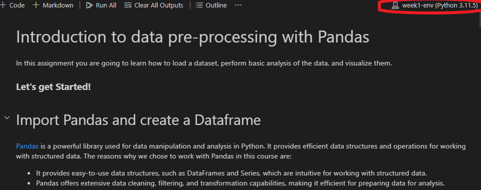

# MLV Week 1

1. The first step is to open a terminal and navigate to the directory that contains the `requirements.txt` file of week 1. You can navigate in the terminal with the command `cd`.

2. Create the Conda environment with the following command: `conda create --name week1-env --file requirements.txt`. We create now an environment called week1-env that contains the packages that are registered in the requirements.txt file.

3. When we open the notebook, we can attach the kernel by pressing the button on the top right of the notebook. In the image below you see where to click.

4. You are now ready to start programming!